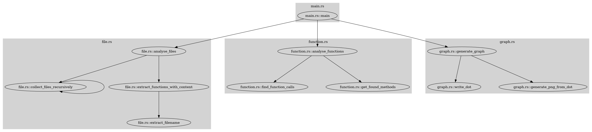

# code_graph

`code_graph` is a Rust-based tool that analyzes Rust codebases and generates a visual call graph of their functions. It helps developers understand the structure and relationships between functions across their project by producing a graph image.

## How It Works

- **Rust Source Analysis**: Scans recursively all `.rs` files in a target directory.
- **Function Extraction**: Parses Rust files to extract functions and their bodies.
- **Call Detection**: Determines which functions call each other within the codebase.
- **Graph Generation**: Builds a call graph (in DOT format) and produces a PNG image using Graphviz.

## How to Use

### Prerequisites

- Rust toolchain installed ([Install Rust](https://www.rust-lang.org/tools/install))
- [Graphviz](https://graphviz.gitlab.io/download/) installed and `dot` command available in your PATH

### Build

Clone the repository and build the executable:

```bash
git clone https://github.com/mathieuemery/code_graph.git
cd code_graph
cargo build --release
```

### Run

Analyze your Rust project (replace `/path/to/your/rust/project` with your actual folder):

```bash
./target/release/code_graph /path/to/your/rust/project
```

- This will produce two files in the current directory:
  - `graph.dot` – DOT representation of the call graph
  - `graph.png` – PNG image of the call graph

### Example Output

Below is an example of the output graph generated for a this Rust project:



## Contributing

Feel free to submit issues or pull requests to improve `code_graph`!

## License

MIT License